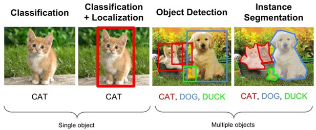

### [Research-Project-II]

# Weakly Supervised Object Detection using AIHub Sidewalk Dataset

## 1. 연구 목적 (Problem Statement)

본 연구는 Object Detection 이라는 Task 에 Weakly Supervised Learning 을 이용하여 모델을 학습시킴으로써 기존 Object Detection 이 가지고 있는 비용적 한계를 극복하고, 더 적은 비용으로 기존의 모델과 유사한 성능의 예측도를 가지게 하는 Weakly Supervised Object Detection Task에 관한 것이다. 본 연구에서는 WSOD Task의 SOTA model인 wetectron의 구조를 이해 및 분석하고, 인도보행과 관련된 Custom Image Dataset을 학습할 수 있는 형태로 해당 모델을 변형하여 응용해보는 것을 목적으로 한다.

## 2. 연구 배경 (Motivation and background)

### 1) Weakly Supervised Object Detection



Figure 1. 대표적인 Computer Vision task 구분

Computer Vision 분야는 크게 Localization과 Object Detection, 그리고 Segmentation으로 구분된다. 그중 Object Detection은 한 개 이상의 Object가 이미지에 존재할 때, 각각의 Object의 위치를 Bounding Box로 지정하는 동시에 Object의 Class를 분류하는 Task를 말한다. 이때 학습을 위해 대량의 이미지와 그 이미지에 대한 Class에 대한 정보, 그리고 Bounding Box의 좌표가 그 학습 데이터로 들어가게 된다. 하지만, 각각의 이미지에 Object를 Labeling을 하고 Bounding Box를 생성하는 과정에서 많은 인력과 시간, 비용이 소모된다는 한계가 있다. 이러한 비용적 한계를 줄이고자 나타난 개념이 Weakly Supervised Learning이다. 이는 기존의 학습 데이터 Label보다 부족한(Weakly) 정보만을 가지고, 더 많은 결과를 생성하게 한다. 즉, 이를 Object Detection Task에 적용할 경우, 이미지 Class에 대한 정보(Weakly한 정보)만을 학습 데이터로 입력하여 Classification 뿐만 아니라 Bounding Box까지 탐지하게 하는 것이다. 이와 관련된 연구 분야를 Weakly Supervised Object Detection (이하 WSOD)이라고 한다. 물론 WSOD model의 결과는 비교적 Fully annotated training data로 학습한 모델의 결과보다는 정확도 측면에서 조금 떨어질 수밖에 없다. 하지만 학습 데이터를 Labeling하는 작업의 비용적 측면에서의 한계를 극복할 수 있기에, 정확도와 비용 trade-off 사이의 균형을 찾아 효과적인 결과를 내는 것이 WSOD의 가장 큰 의의라고 할 수 있다.

### 2) Wetectron : The State-of-the-Art Model of WSOD

현재 WSOD분야의 the State-of-the-Art Model은 2020년 NVIDIA와 University of Illinois, University of California에서 함께 제작한 wetectron[2]이라는 Model로, PASCAL VOC과 COCO dataset을 사용한 연구 중 가장 높은 성과를 낸 model이다. 이는 Instance Ambiguity (Object 누락 및 그룹화 등의 결과가 모호하게 나타나는 현상), Part Domination (Object의 일부만 Bounding Box로 처리되는 현상), Memory Consumption과 같은 WSOD에서 흔히 나타나는 문제에 집중하여 연구한 모델이다.


_Figure 2전형적으로 WSOD에서_ _나타나는_ _문제 :
(1) Instance Ambiguity(Missing & Grouped)
(2) Part Domination_

### 3) Dataset : AIHub Sidewalk Dataset

본 연구에서는 wetectron에서 이미 사용한 VOC나 COCO가 아닌 한국지능정보사회진흥원 AIHub에서 제공하는 “인도보행 영상”의 Bounding Box Dataset (이하 AIHub Sidewalk Dataset)이란 Custom Dataset을 사용한다.  이는 인도 보행 시 충돌 위험이 존재하는 이동체와 고정체를 분석하여 아래의 Object 27종에 대해 box 형태로annotation한 데이터를 구축한 Image Dataset이다.


Figure 3 AI Hub Sidewalk Dataset Image Example

| 분류  | 이동체           | 고정체 |
| ----- | ---------------- | ------ |
| Label | Bicycle (자전거) |

Bus (버스)
Car (승용차, 승합차)
Carrier (리어카, 손수레)
Cat (고양이)
Dog (개)
Motorcycle (오토바이)
Movable_signage (이동식 홍보 전시물/안내판)
Person (사람)
Scooter (변속 기어가 없는 이륜차)
Stroller (유모차)
Truck (트럭)
Wheelchair (휠체어) | Barricade (바리케이드)
Bench (벤치)
Bollard (볼라드)
Chair (1인 의자)
Fire_hydrant (소화전)
Kiosk (키오스크)
Parking_meter (주차요금정산기)
Pole (대/기둥)
Potted_plant (화분)
Stop (버스/택시 정류장)
Table (탁자)
Traffic_light (신호등)
Traffic_sign (교통표지판)
Tree_trunk (가로수 기둥) |

## 3. 연구 방법(Design and implementation)

기존 연구 자료를 바탕으로 wetectron model을 분석한 후, AIHub의 인도보행 영상Dataset을 학습시킨 결과를 도출해보고자 한다.

Weakly Supervised Object Detection의 SOTA 모델인 wetectron은 PASCAL VOC 와 COCO라는 Dataset을 사용하여 결과를 도출해냈다. 많은 관련 연구에서ILSVRC (ImageNet)을 사용하는 경우가 많아, 연구 계획 당시에는 이를 사용하여 “Wetectron model using ImageNet dataset”이란 주제로 연구를 진행하려 하였으나, 많은 연구에서 이미 사용한 Dataset보다는 특정 주제를 가지고 응용 가능성이 있는 Dataset을 학습시킨 결과를 도출하는 것이 더 의미 있을 것이라 판단하여, AIHub의 인도 보행 이미지를 사용하는 것으로 연구 진행 방향을 변경하게 되었다.

전체적인 연구 진행은 1. wetectron을 Baseline model로 하기 위해 그 구조를 이해한 후, 2. 해당 모델을 적절히 변형하여 AIHub Sidewalk Dataset을 학습할 수 있도록 제작하는 방향으로 진행하였다. 기존에 COCO dataset과 PASCAL VOC dataset을 학습한 결과를 도출하는 과정을 분석하고, Custom Dataset을 사용한 여러 Reference Model들을 참고하여, 해당 Dataset을 학습시킬 수 있는 형태의 Model로 적절히 변형하고 그 결과를 해보고자 한다.

### 1) wetectron structure with model zoo model

먼저 model 설계 및 Wetectron 구조 이해에 필요한 기초 배경 지식을 이해하고 논문 내용을 분석하였다. 이후, 해당 분야의 SOTA model인 Wetectron의 원리와 연구 과정이 기재 되어있는 논문[2]을 바탕으로 그 구조를 이해하기 위해 Wetectron github에서 제공하는 Model Zoo의 model들 중 두 모델을 골라 backbone model 및 train, test data를 참고하여 그 과정을 똑같이 reproduce하고자 하였다. Wetectron model이 사용한 PASCAL VOC2007과 2012, 그리고 COCO2014, 2017 Dataset을 download하고, model 사용에 필요한 package들을 설치 및 환경 세팅을 진행하였다. 이후, Model zoo에 안내되어 있는 model의 세부사항들을 참고하여 그 과정을 재현하였으며, pretrained된 model을 이용한 evaluation도 함께 진행하여 그 결과를 비교해보았다.

### 2) Training using AI Hub Sidewalk Dataset

Wetectron은 Pascal VOC와 COCO Dataset을 학습하기 위한 Tool은 제공하지만, 그 외의 Custom Dataset을 사용하기 위해서는 해당 Dataset에 따른 추가적인 구현이 필수적이다. Wetectron에서 제공하는 docs의 USE_YOUR_OWN_DATA 라는 markdown파일을 참고하여 구현하였다.

1. Configurations

   먼저, 사용할 Dataset에 따른 Configuration파일이 필요하다. Config 파일은 Train, Test Dataset File, Num class, loss등 Model Setting을 위한 전반적인 구성 정보가 담겨있는 파일이다. AIHub Sidewalk Datasets 에 따른 Num Class나 Dataset 경로에 대한 정보를 설정하였다.

2. Proposals과 Faster RCNN

   Faster RCNN은 기존의 Fast RCNN의 구조를 그대로 사용하면서, Region Proposal Network을 사용하여 원본 이미지에서Regional Proposal을 자체적으로 추출하여 ROI를 계산하는 방식의 모델이다. 기존의 wetectron은 Faster RCNN을 사용하지 않고 이미 Dataset마다 제공되는 Proposal파일을 사용하였지만, Custom Dataset의 경우 Proposal파일이 없기 때문에Faster RCNN을 사용하여 Proposal 없이도 동작할 수 있도록 구현하였다.

   

3. Preprocessing Annotation File

   Annotation xml파일에는 Dataset의 각 Image마다의 Object bbox와 class에 대한 정보가 담겨있다. 그 구조에 맞게 이를 preprocessing하여 dictionary화 하는 과정이 필요하다. AIHub의 annotation xml 구조는 아래의 그림과 같이 되어있다. 이를 바탕으로, 해당 annotation 을 processing할 수 있도록 아래의 코드와 같이 구현하였다.

   

   ```python
   def _preprocess_annotation(self, target):
           boxes = []
           classes = []
           for box in target.iter("box"):
               cls = box.attrib['label']
               bbox = [
                   float(box.attrib['xtl']),
                   float(box.attrib['ytl']),
                   float(box.attrib['xbr']),
                   float(box.attrib['ybr']),
               ]
               bndbox = tuple(map(lambda x: x - 1, list(map(int, bbox))))
               boxes.append(bndbox)
               classes.append(self.class_to_idx[cls])

           im_info = tuple(map(int, (target.attrib['height'], target.attrib['width'])))
           res = {
               "boxes": torch.tensor(boxes, dtype=torch.float32),
               "labels": torch.tensor(classes),
               "im_info": im_info,
           }

           return res
   ```

## 4. 연구 결과 및 평가 (Methodology and evaluation)

### 1) wetectron structure with model zoo model

pretrained model은 model zoo에서 제공하는 이미 pretrained된 model의 .pth파일을 실행해 본 결과이고, reproduced model은 해당 pretrained model과 같은 backbone model과 dataset을 사용하여 wetectron의 code를 실행했을 때의 결과를 의미한다. 선택한 두 model은 VGG-16+COCO 2014를 사용한 모델과 VGG-16 + VOC2007을 사용한 model이다. Table1과 2에서 볼 수 있듯, Reproduced model과 Pretrained model의 mAP 혹은 AP, AP50값이 서로 거의 유사하게 나타나는 것을 확인할 수 있다.

Case 1 :

VGG-16 + VOC2007

Train : VOC2007 train+val

Test : VOC2007 test

Backbone : VGG-16

**reproduced mAP :** 50.7


**pretrained mAP :** 54.9


Case 2 :

VGG-16 + COCO 2014

Train : COCO2014 train

Test : COCO2014 val

Backbone  : VGG-16

**reproduced AP : 1**0.6 | AP50 : 22.5


**pretrained AP : 11**.7 | AP50 : 24.0


### 2) Training using AI Hub Sidewalk Dataset

**Use Fully Annotated**


_Figure 5  Fully Supervised Result using AIHub Sidewalk Dataset Sample Images_

**Use Weakly Annotated**


_Figure 5  Weakly Supervised Result using AIHub Sidewalk Dataset Sample Images_

위의 Image들는 Test Dataset의 같은 Image에 대해, 앞선 연구 방법에서 제시한 Weakly Supervised을 사용한 Model과 그렇지 않은 Model로 각각 Test한 결과를 비교한 것이다. Fully Annotated의 경우(좌측 사진)엔 제시한 대부분의 Object를 높은 정확도로 Detect하였다. 반면 WSOD를 사용할 경우(우측 사진), Tree Trunk나 Pole과 같은 비교적 단순한 물체는 탐지하지만, 조금 복잡한 물체에 대해서는 쉽게 탐지하지 못하는 결과를 보였다.

## 5. 토론 및 전망 (Discussion and future work)

본 연구를 통해 Weakly Supervised Object Detection이라는 Task에 대해 알아보고 해당 Task의 SOTA model인 wetectron의 구조를 이해 및 분석해보았다. 기본적으로 제공되는 Wetectron Model Zoo의 Pascal VOC나 COCO Dataset을 사용한 model들의 결과를 확인해보았고, Custom Image Dataset인 AIHub의 인도보행 이미지를 학습할 수 있는 형태로 해당 모델을 변형하여 응용해 봄으로서 Object Detection Task를 실생활에서 활용할 수 있는 다양한 방안에 대해서도 생각해 볼 수 있었다.

이미 만들어진 Model을 Dataset만 달리하여 학습시키는 것을 주제로 하였기에, 비교적 가시적으로 좋은 결과가 나올 것이라 기대하였으나, WSOD에서 자주 발생하는 Instance Ambiguity, Part Domination 현상이 여전히 많이 발견되고, 기대보다 Object를 정확히 Detect하지 못한 결과가 나와 아쉽게 느껴졌다.  iteration이나 batch 값 등을 조정하여 더 성능을 높이고자 하였으나, 시간 관계상 크게 달라진 결과를 내진 못하였다. 또한, 연구 과정에서 Custom Dataset에 대해서도 evaluation 코드를 변경하여 Average Precision과 같은 정량적인 결과를 도출하고자 하였으나, 구현에 어려움이 있어 정성적 결과만 도출하였다. 사용한 Custom Dataset에 대해서도 정량적 수치(AP)를 구하고, 이를 개선시키는 방법에 대해서 고민해볼 수 있었다면 더 의미 있는 연구가 되었을 것이라 생각하였다.

이 연구가 더 체계적으로 진행되고 보완된다면, Object Detection Task가 사용되는 다양한 분야에서, 적은 비용으로 비교적 높은 정확도를 낼 수 있기에 상당히 유용하게 사용될 기술이라고 생각한다. 특히, 본 연구에 사용한 Sidewalk Dataset과 같은 Image를 학습시킨 고도화된 모델 구현이 이루어진다면, 인도상의 자율 주행 혹은 이동 및 배달 서비스의 위험 모니터링 시스템 등의 산업 분야에서 활용될 뿐만 아니라, 나아가 휠체어 자율 주행 및 인도 상의 보행 장애물 탐지 등에 응용되어 보행이 불편한 장애인의 이동권을 신장을 가능케 하는 등의 공익적인 분야에서도 긍정적으로 활용될 수 있을 것이라 생각된다.
